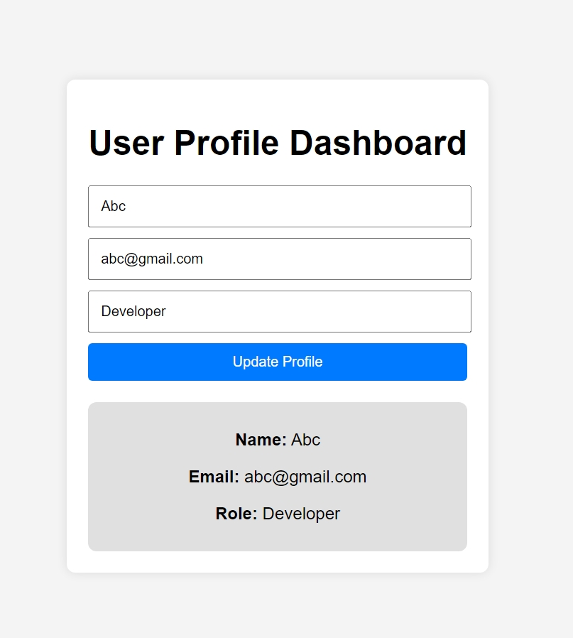

# User Profile Dashboard

## Overview
This project is a User Profile Dashboard built using HTML, CSS, and JavaScript. It allows users to manage profile information including name, email, and role.

## Features
- Update user profile information.
- Display user details dynamically.
- Store user information as an object with properties like `name`, `email`, and `role`.

## Screenshot

## Technologies Used
- HTML
- CSS
- JavaScript

